# Are universities preparing students for real-world jobs?

## 1. Context and Motivation

With the rise of AI and rapid technological change, the job market is evolving at an unprecedented pace, as seen in retrenchments and concerns over market saturation. As universities are a key pathway for skills development, the Ministry of Education (MOE) must ensure that university curricula remain aligned with labour market needs so that students can land desirable jobs.

This project analyses whether current university modules equip students with the skills demanded by today’s job market and uses these insights to inform policy recommendations.

## 2. Scope

### 2.1 Problem Statement

MOE oversees curriculum of publicly-funded universities and faces the challenge of ensuring that university curricula remain aligned with rapidly changing labour market needs. With the rise of AI and technological change, job skill requirements are evolving quickly, but there is currently no clear and scalable way to identify which university modules best prepare students for specific jobs.

Approximately 18,000 graduates in Singapore seek to possibly enter the workforce every year. This affects policymakers, universities, and students. Without such insights, curriculum updates may lag behind industry needs, and students may graduate without the skills most valued by employers.

Data science and machine learning are suitable approaches because module descriptions and job postings are both large-scale text datasets. NLP methods can efficiently analyse and match these texts to identify skill alignment and gaps.

### 2.2 Success Criteria

This project is considered successful if it:

- Identifies which university modules are most relevant to specific job roles or skill demands.
- Highlights curriculum gaps where taught skills do not align well with employer needs.
- Produces results in a scalable and interpretable way that can support policy recommendations.

### 2.3 Assumptions

This project assumes that:

- Job posting data is representative of broader labour market demand.
- Module descriptions accurately reflect the skills taught.
- Similarity between module content and job requirements is a meaningful proxy for job preparedness.

## 3. Methodology

### 3.1 Technical Assumptions

We treat our NLP retrieval methods as fixed off-the-shelf components. Although the underlying lexical and semantic scoring frameworks are established, practical outputs still depend on implementation details such as tokenization, indexing, and pre-trained representation spaces.

Accordingly, we do not tune internal scoring mechanisms themselves. We tune only retrieval thresholds and fusion settings on top of base retrievers. Our key hypothesis is:

- If module content better matches job-demanded skills, relevant jobs should rank higher for that module.
- These module-level signals should aggregate into meaningful degree-level alignment scores.

Figure 1 provides an end-to-end orchestration overview of the full pipeline, from ingestion and feature construction to retrieval, aggregation, and output materialization into analysis tables/CSVs.

<a href="assets/pipeline_orchestration.svg">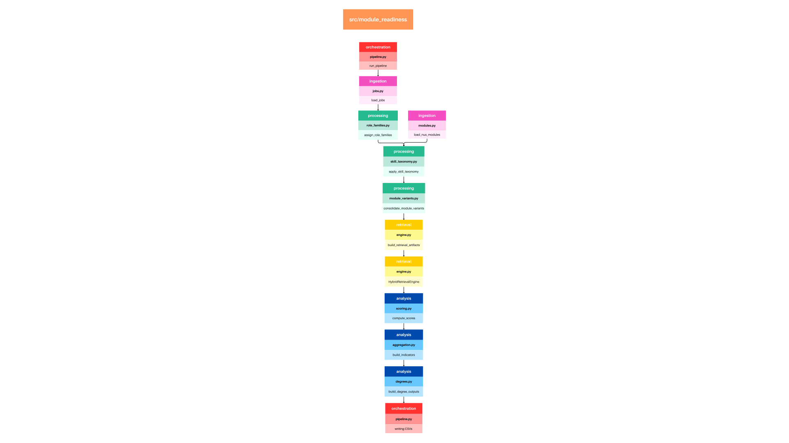</a>

<em>Figure 1. End-to-end pipeline orchestration from ingestion to database/CSV outputs.</em>

<a href="assets/pipeline_orchestration.svg">Open Figure 1 at full size</a>

### 3.2 Data

#### 3.2.1 Collection: Datasets and Data Acquisition

The pipeline integrates five raw datasets stored in the project database. Job postings were collected from MyCareersFuture and ingested as raw JSON records over the extraction window from 25 January 2026 to 31 January 2026. NUS module catalogue data were collected from the NUSMods API and ingested into the module table, with the current run using the Academic Year 2024 to 2025 snapshot. NUS degree-plan data were manually curated from NUS faculty pages and ingested into the degree-plan table to represent curriculum structure by degree. SkillsFuture mapping data were included to standardise and enrich skill terminology across jobs and modules. SkillsFuture mapping uses the official SkillsFuture Skills Framework files to normalize skill names and assign channels (technical vs transferable) consistently across jobs and modules. However, not every skill must already exist in that mapping; unmapped skills are kept through alias normalization and a heuristic channel fallback. This makes mainstream skills collection robust while remaining flexible to emerging or niche terms, with transparency preserved through diagnostics that report unmapped skill counts and samples. SSOC 2024 occupational codes were taken directly from the job ads to improve labelling by finding the official government-recognised occupation names at 4-digit and 5-digit levels, allowing for both granularity and compounding to produce role-family assignment and role-level enrichment.

#### 3.2.2 Cleaning and Feature Construction

**Text Data Cleaning**

Raw text from jobs and modules was standardized to create a consistent retrieval surface. Fundamental text cleaning was applied, followed by extraction of relevant job features. Repeated entries were deduplicated so each normalized skill appears once per record. Scope filters were applied to keep the analysis policy-relevant to fresh graduates. For skill-taxonomy handling, noisy or invalid terms were removed, mapped skills were assigned canonical channels (technical vs transferable), and unmapped terms were retained using heuristic fallback classification. The resulting end-to-end cleaning and feature flows are shown in Figure 2 (jobs) and Figure 3 (modules).

**Jobs Pipeline**

Figure 2 provides an overview of the jobs data-cleaning and feature-construction pipeline.

<em>Figure 2. Job data cleaning and feature-engineering pipeline.</em>

After cleaning, each job is transformed into an analysis-ready feature record for both retrieval and downstream scoring. We enrich each posting with structured occupation fields (SSOC-4/SSOC-5 codes and names), derive skill-channel features (`technical_skills`, `soft_skills`), and construct retrieval text representations (`job_text` plus appended technical skill terms). These enriched job records feed directly into hybrid BM25+embedding retrieval and later provide the evidence rows used in module-role and module-SSOC aggregation.

**Job Role-Family Assignment (Step 8)**

To expand on role-family assignment, which is central to our downstream analysis (Step 8 in Figure 2), each job is assigned to one of 18 curated role families using a deterministic waterfall:

1. Exact SSOC-5 match.
2. If unavailable, exact SSOC-4 match.
3. If still unresolved, keyword/category split rules.
4. If no split rule applies, legacy-family fallback.
5. Final fallback: `Other`.

After assignment:
1. `role_family` and `role_family_name` are set to the selected role cluster.
2. `broad_family` is derived from the cluster-to-broad-family mapping.
3. `role_family_source` is stored for traceability.

These enriched role labels are then used in downstream module-role scoring.

**Modules Pipeline**

Figure 3 provides an overview of the modules data-cleaning and feature-construction pipeline.

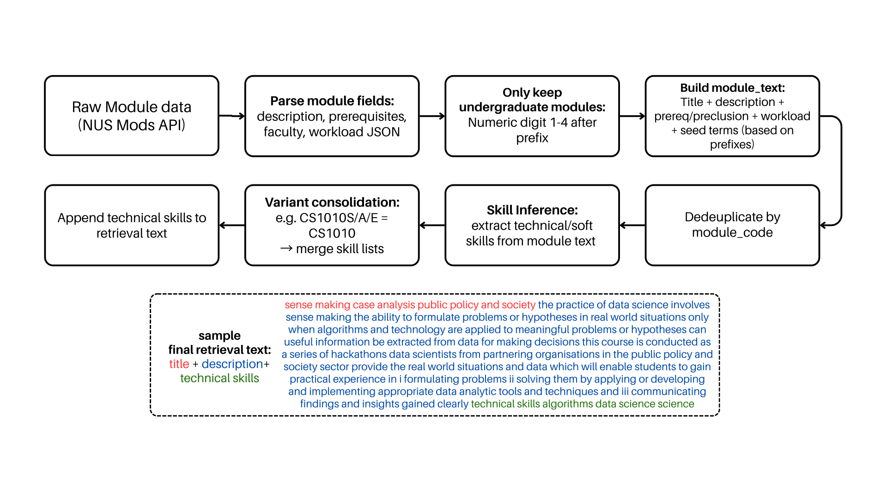

<em>Figure 3. Module data cleaning and feature-engineering pipeline.</em>

Module processing follows a parallel ingestion-to-feature pipeline, using the same core cleaning approach as jobs. We filter to undergraduate modules and consolidate variant codes by normalizing to a base code (for example, ACC1701A and ACC1701B map to ACC1701). Variant rows are merged into one base-module record: list fields (for example, `technical_skills`, `soft_skills`) are unioned and deduplicated, while non-list metadata is taken from a representative row. This reduces score fragmentation across suffix variants and keeps retrieval and degree-mapping outputs aligned to a single module key. The final module representation is used as the retrieval query against the job corpus and as input to module-level alignment scoring, with retrieval text constructed from normalized title + description + appended technical skill terms.

**Degree-Level Aggregation**

For degree-level skill supply, each degree is first decomposed into requirement buckets, and each bucket is expanded into concrete module codes (via exact matching, wildcard expansion, or unrestricted-elective expansion). For a given bucket `b`, the pipeline computes the number of unique matched modules, `bucket_module_count_b`. Each module’s contribution is then credit-adjusted as `skill_weight_(m,b) = module_credits_b / bucket_module_count_b`, so buckets that expand to many modules distribute their credit budget across more candidates. For each degree-skill pair `(d,s)`, these adjusted module contributions are summed over modules in degree `d` that contain skill `s`: `weighted_module_credits_(d,s) = Σ skill_weight_(m,b(m))`. Finally, the score is normalized by the degree’s total required (non-unrestricted) credits: `supply_score_(d,s) = weighted_module_credits_(d,s) / required_credit_count_d`. This yields a degree-normalized estimate of how strongly each technical skill is represented in required curriculum coverage.

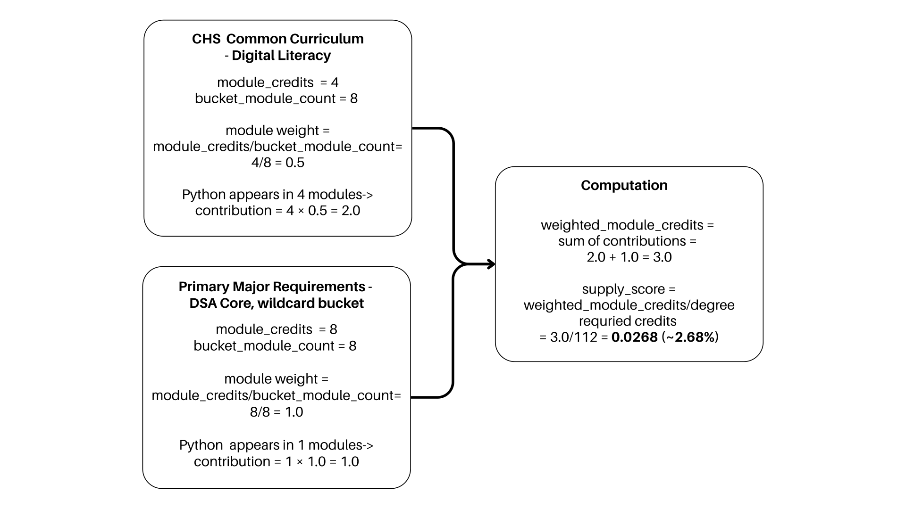

<em>Figure 5. Worked example of degree-level, credit-adjusted skill-supply aggregation.</em>

Finally, outputs are materialized as analysis tables and export files for reporting and querying, with optional database persistence enabled in pipeline execution.

**Data Splitting**

There is no conventional train/test split in the core pipeline because it does not train a supervised model from scratch; it is a deterministic retrieval-and-aggregation pipeline using a pre-trained embedding model.

### 3.3 Experimental Design

#### 3.3.1 Algorithms

The retrieval pipeline combines lexical and semantic channels, then fuses both ranked lists to produce top-`k` module-job matches for downstream aggregation (Figure 4). We deliberately used both channels because module-job matching has two distinct failure modes. First, some relevance is explicit and keyword-driven (for example, `python`, `sql`, `tableau`), where lexical exactness matters. Second, many relevant matches are phrased differently across module descriptions and job ads; semantic retrieval helps preserve these paraphrastic matches instead of filtering them out too early.

**BM25 lexical channel**

BM25 is implemented with `BM25Okapi` over tokenized `retrieval_text` (normalized base text plus appended technical-skill terms). For a query module \(q\) and job document \(d\):

$$
s_{\text{BM25}}(q,d)=\sum_{t \in q}\text{IDF}(t)\cdot
\frac{f(t,d)\cdot(k_1+1)}
{f(t,d)+k_1\left(1-b+b\cdot\frac{|d|}{\text{avgdl}}\right)}
$$

where \(f(t,d)\) is term frequency, \(|d|\) is document length, \(\text{avgdl}\) is average corpus length, and we use \(k_1=1.2,\; b=0.75\).  
IDF is computed in standard BM25 form:

$$
\text{IDF}(t)=\ln\left(\frac{N-n_t+0.5}{n_t+0.5}+1\right)
$$

with \(N\) documents and \(n_t\) documents containing term \(t\).

To avoid very weak lexical matches, BM25 candidates are screened by a dual threshold:
`bm25_threshold = max(bm25_min_score, bm25_relative_min * bm25_max_score_for_query)`.
We keep a job only if `bm25_score >= bm25_threshold`.

**Embedding semantic channel**

We use `sentence-transformers/all-MiniLM-L6-v2` to encode both modules and jobs into a shared 384-dimensional space, then L2-normalize both vectors:
`query_embedding = normalize(model(module_text))`
`job_embedding = normalize(model(job_text))`

Semantic relevance is computed as:
`embedding_score = max(0, cosine(query_embedding, job_embedding))`
So negative cosine values are treated as no semantic match.

Embedding candidates use the same threshold pattern:
`embedding_threshold = max(embedding_min_similarity, embedding_relative_min * embedding_max_score_for_query)`.
We keep a job only if `embedding_score >= embedding_threshold`.

In deployment, thresholding was intentionally asymmetric. BM25 is moderately filtered to suppress obvious lexical noise, while embedding retrieval is kept broad so semantically related candidates remain in the pool even when surface wording differs strongly. Final deployed values are reported in Section 3.3.3.

**Rank fusion and normalized fused score**

In simple terms, thresholds are used to remove weak/noisy matches. Higher thresholds are stricter (cleaner but fewer matches), while lower thresholds are looser (more matches, including borderline ones).

For two retrievers (BM25 and Embedding), Reciprocal Rank Fusion is:
`rrf_score = 1 / (rrf_k + bm25_rank) + 1 / (rrf_k + embedding_rank)`.
Here, `rrf_k` controls how strongly very top ranks are emphasized (final deployed value in Section 3.3.3).

For stable cross-query reporting, fused scores are min-max normalized to `[0,1]`:
`normalized_fused_score = (rrf_score - min_rrf_score) / (max_rrf_score - min_rrf_score + eps)`,
where `eps` is a small constant for numerical stability. The top-`k` jobs by `normalized_fused_score` populate module-job evidence tables, which then feed module-role scoring, module summaries, and degree-level aggregation.

<a href="assets/ml_workflow.svg">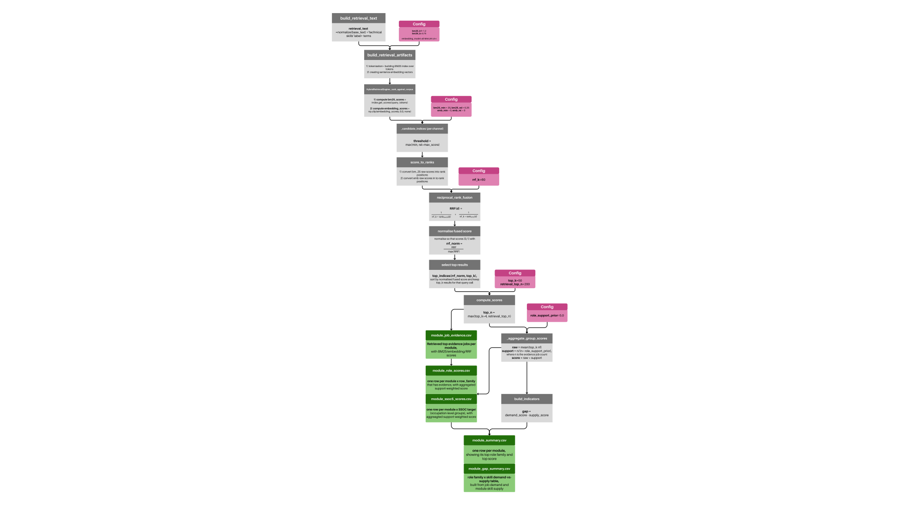</a>

<em>Figure 4. Hybrid retrieval and scoring workflow (BM25, embeddings, thresholding, and RRF fusion).</em>

<a href="assets/ml_workflow.svg">Open Figure 4 at full size</a>

#### 3.3.2 Evaluation

We evaluated retrieval primarily with nDCG@10, with Precision@10 and Recall@10 as secondary diagnostics, using a manually labelled module-job relevance dataset. In the absence of external ground truth, we randomly sampled 200 modules, retrieved the top 20 jobs per sampled module from each ranker (Hybrid, BM25, Embedding), pooled the union of candidates, and labelled relevance on a 4-point ordinal scale (0 = weakest match, 3 = strongest match). For binary diagnostics, positives were defined as `relevance >= 2` to reduce false positives from broad lexical or semantic overlap.

nDCG@10 is the primary metric because this is a ranked retrieval task with graded labels and decision-makers focus on top-ranked results. Based on mean performance, Hybrid achieved the best nDCG@10 (0.657), ahead of Embedding (0.640) and BM25 (0.554). Under `relevance >= 2`, Hybrid achieved mean Precision@10 = 0.353 and mean Recall@10 = 0.350. This indicates that combining lexical and semantic retrieval improves top-rank quality versus either channel alone. Full results are shown in Table 1.

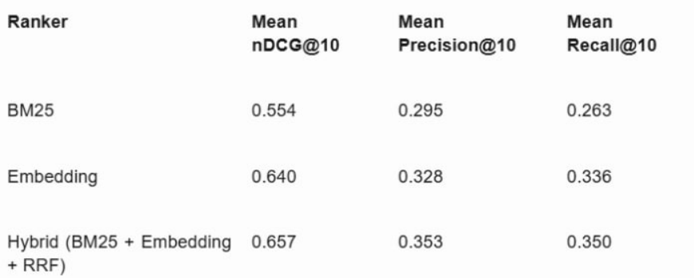

<em>Table 1 (image export). Mean retrieval metrics across BM25, Embedding, and Hybrid rankers.</em>

#### 3.3.3 Training and Hyperparameter Selection

Final deployed settings were chosen as a coverage-first operating point:
`bm25_min_score = 20`, `bm25_relative_min = 0.25`, `embedding_min_similarity = 0`, `embedding_relative_min = 0`, `rrf_k = 60`, `top_k = 50`, and `role_support_prior = 5`.

Asymmetric thresholding was used intentionally: BM25 is moderately filtered to remove clear lexical noise, while embedding candidates are kept broad to avoid discarding semantically valid matches expressed with different wording. Fusion is done with RRF (`rrf_k = 60`) to combine both channels while reducing sensitivity to small rank swaps at the top of the list.

Downstream aggregation uses `top_k = 50` to cap role-evidence volume, preventing very large candidate sets from dominating purely by row count. We also apply support shrinkage with a moderate prior:
`support_weight = evidence_job_count / (evidence_job_count + role_support_prior)`,
where `role_support_prior = 5`. This behaves like adding about five pseudo-evidence jobs before fully trusting a family score, reducing overreaction to sparse evidence while still allowing strong-evidence families to converge toward full weight.

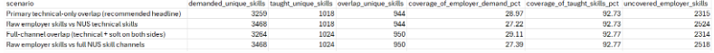

<em>Figure 6. Scenario comparison used to select the final coverage-first operating point.</em>

## 4. Findings

### 4.1 Results

Key result visualizations are provided in Figures 7 to 10.

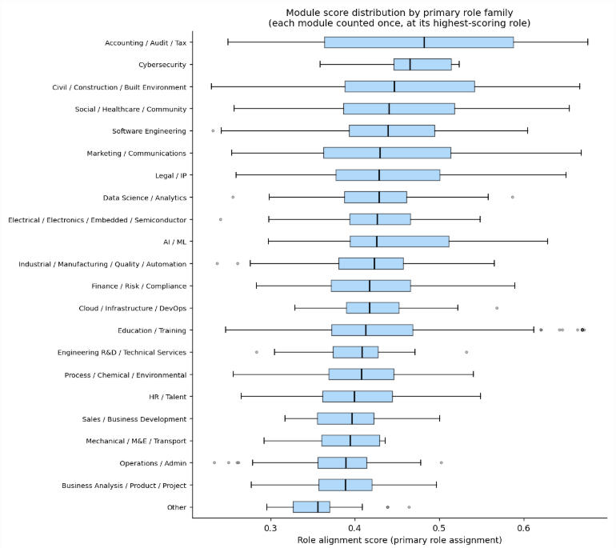

<em>Figure 7. Distribution of module alignment scores by primary role family.</em>

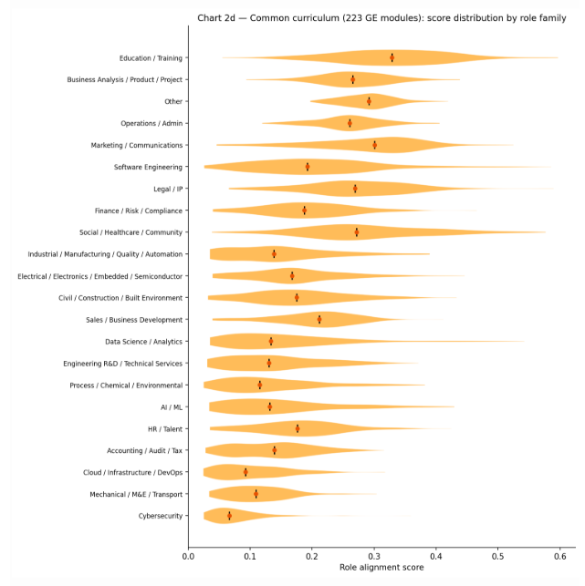

<em>Figure 8. Common-curriculum score distributions by role family.</em>

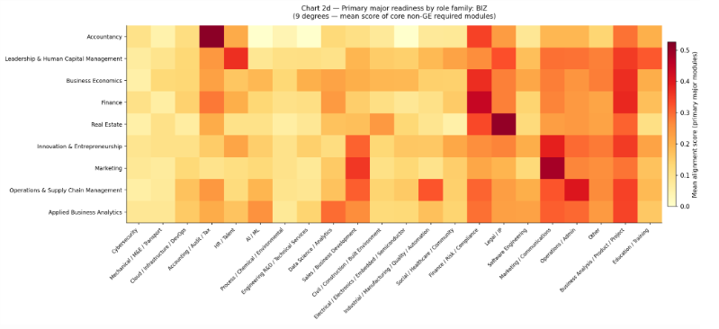

<em>Figure 9. Primary-major readiness heatmap by role family.</em>

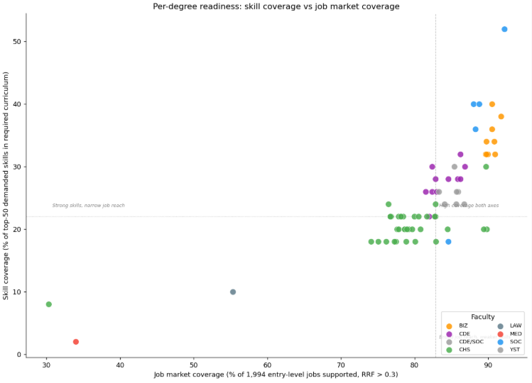

<em>Figure 10. Degree-level readiness: curriculum skill coverage versus job-market coverage.</em>

### 4.2 Discussion

Key discussion points:

- Hybrid retrieval achieved the strongest overall ranking performance.
- Practical concerns about bias/feedback loops should be assessed.
- Preclusion constraints were not explicitly modelled; some highly ranked modules may not be feasible within specific degree pathways.
- Score ranges and confidence should be interpreted with evidence coverage in mind.
- Project-based and hands-on modules tend to show stronger skills alignment signals.
- Higher-level modules (for example, 3000/4000-level) often rank highly, suggesting stronger specialization signals.

### 4.3 Recommendations

We recommend deploying the dashboard as an MVP for MOE curriculum policy review. It is transparent, explainable, and usable by non-technical stakeholders, with filters by role family, faculty, and programme, and core outputs on module-role fit, degree-level skill coverage, and prioritised skill gaps. A Career Query Assistant is also included to interpret job queries and suggest relevant modules.

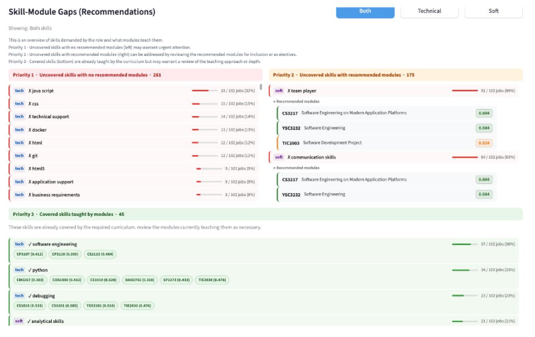

<em>Figure 11. Streamlit dashboard view: skill-module gap recommendations.</em>

Policy actions should focus on making curriculum alignment more explicit, targeted, and proactive. First, universities should strengthen skill signalling in module design by clearly stating technical outcomes (for example, tools, programming languages, and applied competencies) in module titles, descriptions, and metadata. Second, MOE and universities can use measured degree-level skill gaps to prioritize curriculum refresh where employer demand is consistently high but curriculum coverage is weak. Third, degree-to-role evidence can support student advising on electives and career pathways. Finally, the dashboard can serve as an early-warning system by flagging persistent undersupply areas for review.

Module syllabi and feedback contain richer evidence than public module descriptions but are not openly accessible. Closer NUS-MOE collaboration on controlled data access would improve analysis quality in future iterations.

## 5. Limitations

The model has several practical limitations. First, NUSMods descriptions are often brief and may not fully reflect actual teaching scope. Since the model does not observe richer teaching artifacts (for example, syllabi, assignments, or project briefs), skill extraction and module-job matching can be incomplete.

Second, the current job corpus covers only a one-week posting window. This can introduce short-term hiring noise and posting-volume imbalance across role types, so results should be interpreted as a demand snapshot rather than a full long-run market picture.

Third, sentence embeddings can underperform when rare or domain-specific keywords are critical, because they emphasize overall semantic similarity over exact term matching. BM25 mitigates this by preserving lexical precision, but the limitation is not fully removed in a hybrid setup.

Fourth, role-family grouping improves interpretability but can mask variation within a role family. Evaluation coverage is also constrained by the manually labelled sample size, and external robustness remains limited because the current implementation is centered on NUS and not yet generalized to other universities.

## 6. Future Work

Future work should strengthen data depth, time coverage, and modelling granularity. On the education side, incorporating richer module evidence (for example, syllabi, assignments, and project briefs) would capture skills that are currently implicit in short catalogue descriptions. On the labour side, collecting postings over a longer horizon would reduce short-term bias and provide a more stable view of demand.

Methodologically, role-family definitions can be refined to better represent within-family skill differences. Expanding skill taxonomy and alias coverage for emerging and tool-specific terms would also improve extraction quality and make skill-gap analysis more complete for curriculum review.

## 7. Conclusion

This project provides a scalable and interpretable NLP retrieval framework to assess how well university modules align with labour market skill demands. The hybrid lexical-semantic approach performs best in ranked retrieval quality and provides actionable signals at both module and degree levels, offering a practical evidence base for curriculum and policy planning.
